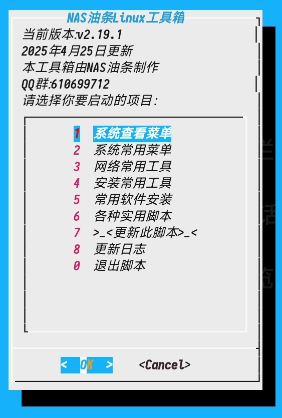

# NAS油条工具箱
由**NAS油条**一个人制作
#### 介绍
NAS油条Linux_Termux工具箱

#### 软件架构
适用于Termux,Linux各种版本。
shell脚本

### 懒人脚本。
 **直接在终端中输入。** 
```
bash -c "$(curl -L linux.class2.icu/shell/nasyt.sh)"
```
 **如果不行用这个。** 

```
bash -c "$(curl -L nasyt.class2.icu/shell/nasyt.sh)"
```


#### 参与贡献

1.  NAS油条
