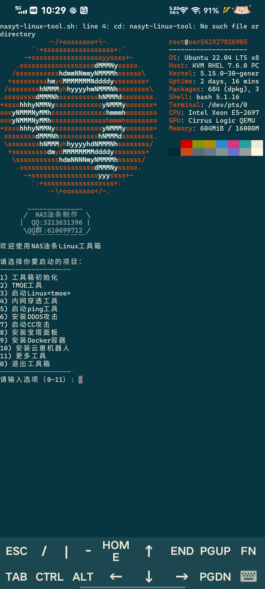

# NAS油条工具箱
由**NAS油条**一个人制作
#### 介绍
NAS油条Linux_Termux工具箱

#### 软件架构
适用于Termux,Linux各种版本。
软件架构shell


#### 脚本安装教程

Linux安装git
```
apt install git
```

Termux安装git

```
pkg install git
```
 **_______________________________________________** 

 **安装方式一:克隆仓库** 
```
git clone https://gitee.com/nasyt/nasyt-linux-tool.git
```

 **安装方式二:下载发行版**
下载到home目录

解压压缩包
```
unzip nasyt-linux-tool.zip
```
 **_______________________________________________** 


 **启动脚本** 

```
bash nasyt-linux-tool/nasyt-linux-tool.sh
```


#### 使用说明
此脚本仅用了"两天"做成

#### 参与贡献

1.  NAS油条


#### 

1.  
2.  Gitee 官方博客 [blog.gitee.com](https://blog.gitee.com)
3.  你可以 [https://gitee.com/explore](https://gitee.com/explore) 这个地址来了解 Gitee 上的优秀开源项目
4.  [GVP](https://gitee.com/gvp) 全称是 Gitee 最有价值开源项目，是综合评定出的优秀开源项目
5.  Gitee 官方提供的使用手册 [https://gitee.com/help](https://gitee.com/help)
6.  Gitee 封面人物是一档用来展示 Gitee 会员风采的栏目 [https://gitee.com/gitee-stars/](https://gitee.com/gitee-stars/)
